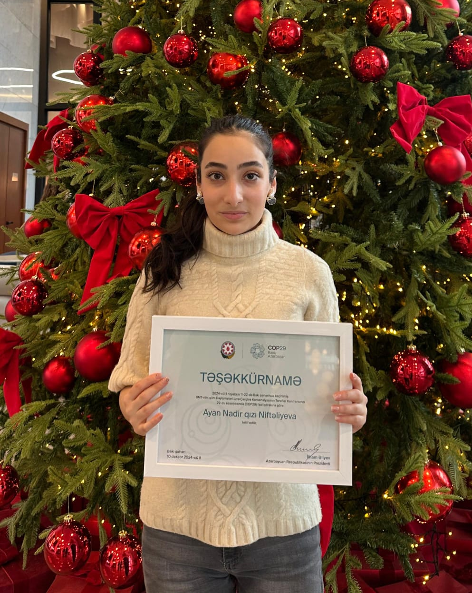
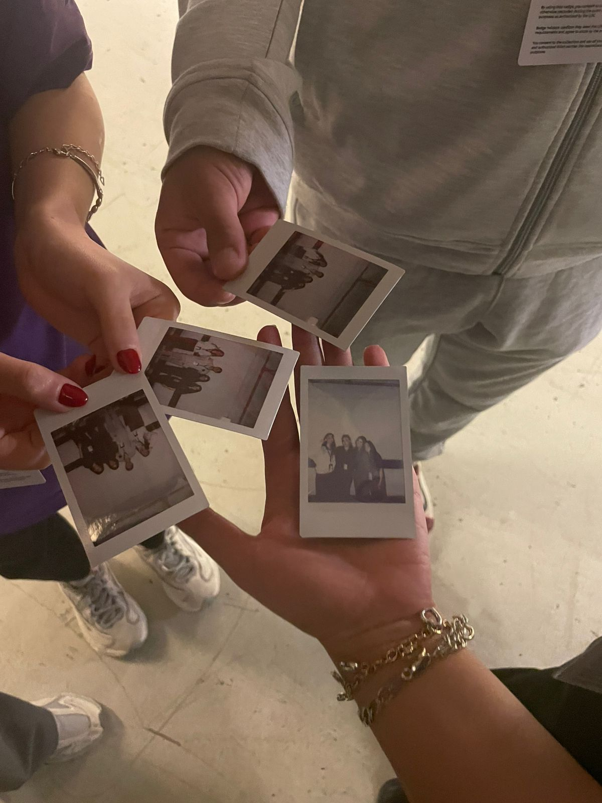
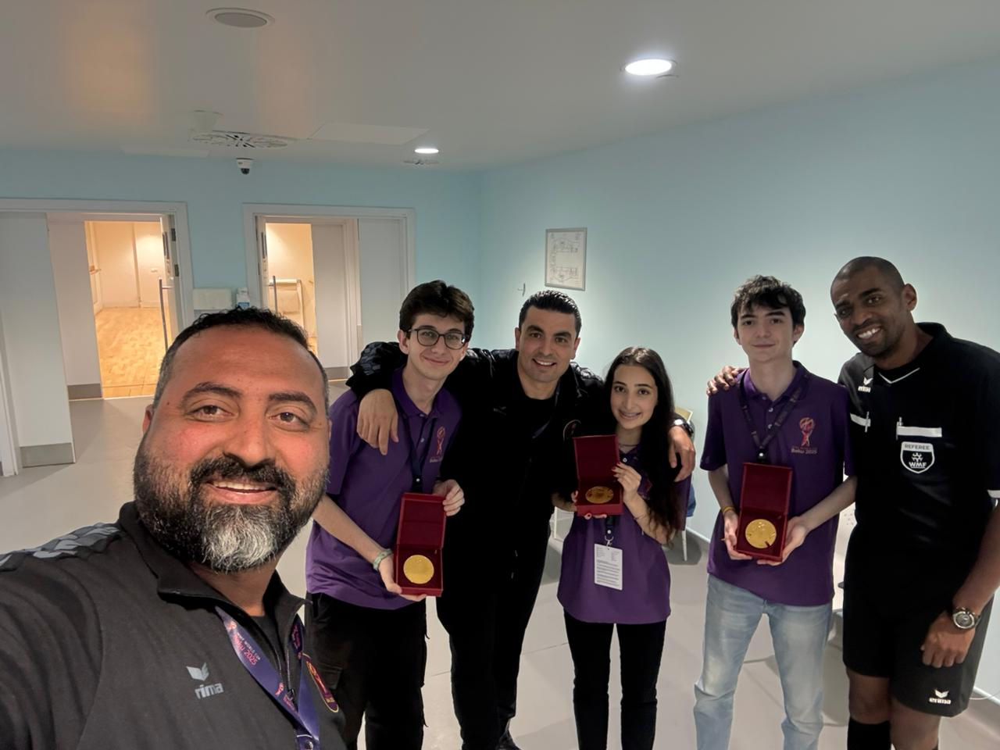
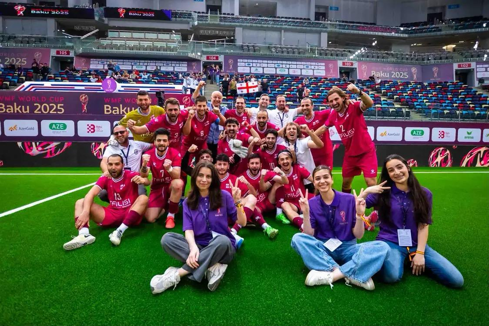
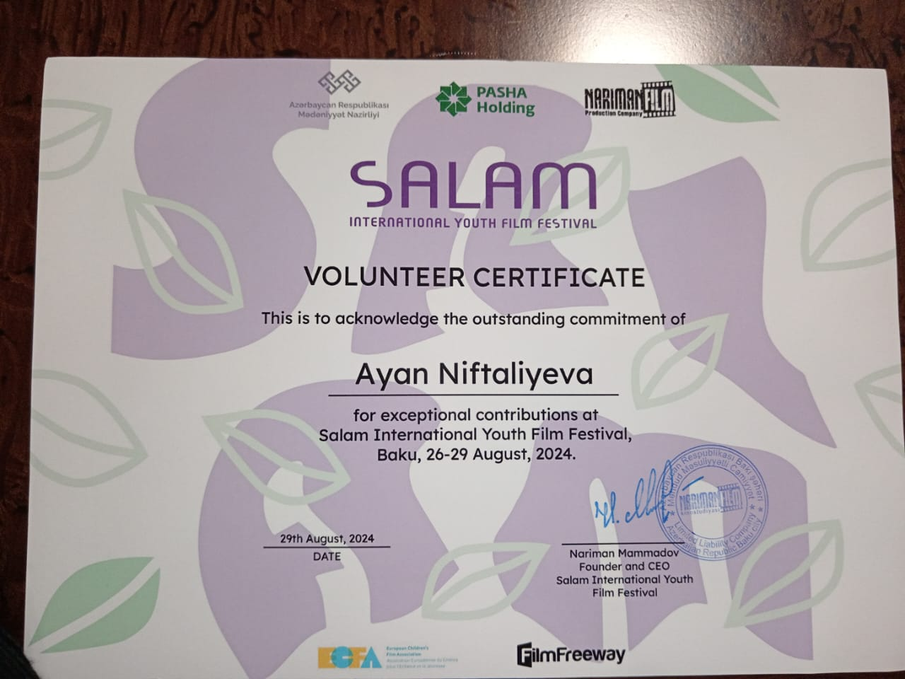

# Projects & Experiences

### Project 1: Logic Gates Simulation
A deep dive into Boolean algebra and binary logic.
<video width="100%" controls>
  <source src="./assets/images/logic-video.mp4" type="video/mp4">
</video>

---

### Hour of Code (HOC)
Strengthening algorithmic thinking and spreading digital literacy.

<video width="100%" controls>
  <source src="./assets/images/hoc-video.mp4" type="video/mp4">
</video>

---

### Volunteering & International Conferences
I apply "Systems Thinking" to event logistics and high-pressure communication.

**Event Highlights:**
<video width="100%" controls>
  <source src="./assets/images/vol-video.mp4" type="video/mp4">
</video>

  
  
  
  
  

